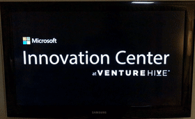

# MIC Media Slide Show

This is a simple solution that I came up with in order to control what content was being shown on all the TV's at the Microsoft Innovation Center in Downtown Miami, FL. 

## Projects in this Repo 

This repo consists of two projects. 

* [MICMediaManager](https://github.com/joescars/MICMediaSlideshow/tree/master/MICMediaManager)
* [MICMediaPlayer](https://github.com/joescars/MICMediaSlideshow/tree/master/MICMediaPlayer)

MICMediaManager is a .NET Core 1.1 web application using MVC, EF and SQL Database. We use this to upload and organize the slides. The slides are stored in [Azure Blob Storage](https://azure.microsoft.com/en-us/services/storage/) and the app it self is running in Azure App Service.

MICMediaPlayer is a UWP application that  calls an exposed API from MICMediaManager with a list of active slides. In then displays the slides to the user. The application runs in Windows 10 IoT Core running on a Raspberry Pi 2.

## Resource Links

* [.NET Core](https://www.microsoft.com/net/download/core)
* [Windows 10 IoT Core](https://developer.microsoft.com/en-us/windows/iot)
* [UWP Platform](https://msdn.microsoft.com/en-us/windows/uwp/get-started/universal-application-platform-guide)
* [Getting Started with Azure Blob Storage](https://docs.microsoft.com/en-us/azure/storage/storage-dotnet-how-to-use-blobs)
* [Visual Studio 2015](https://www.visualstudio.com/)
* [Azure Storage Explorer](http://storageexplorer.com/)

Contact me on twitter [@joescars](https://github.com/joescars)
